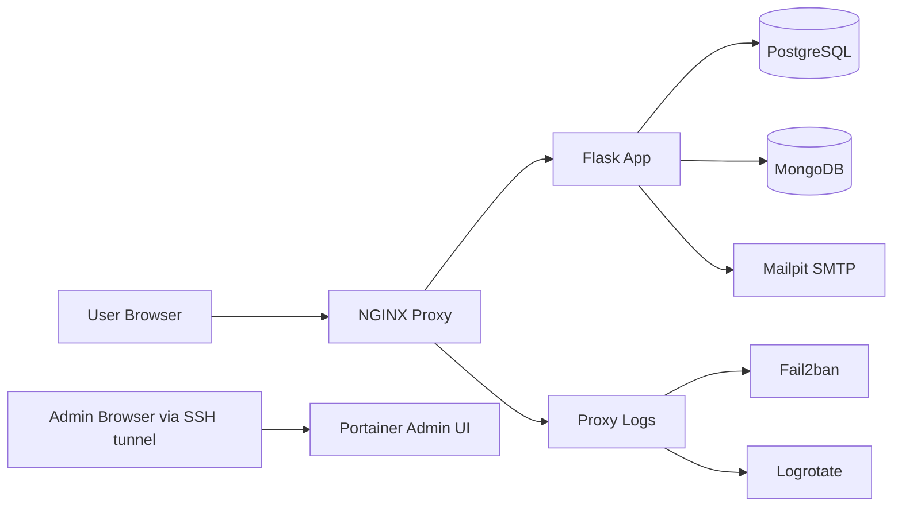
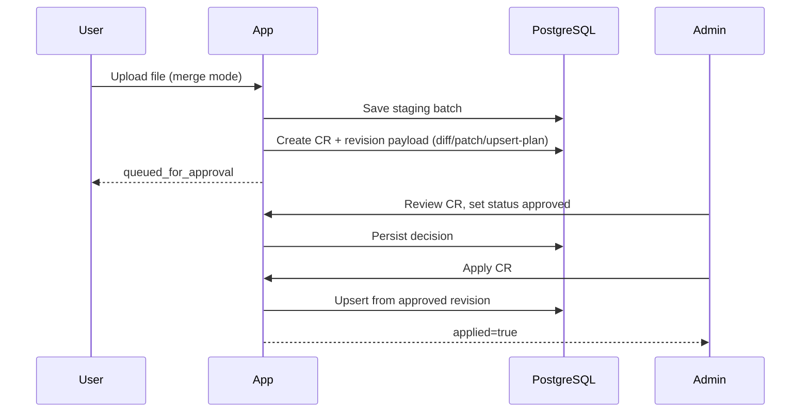
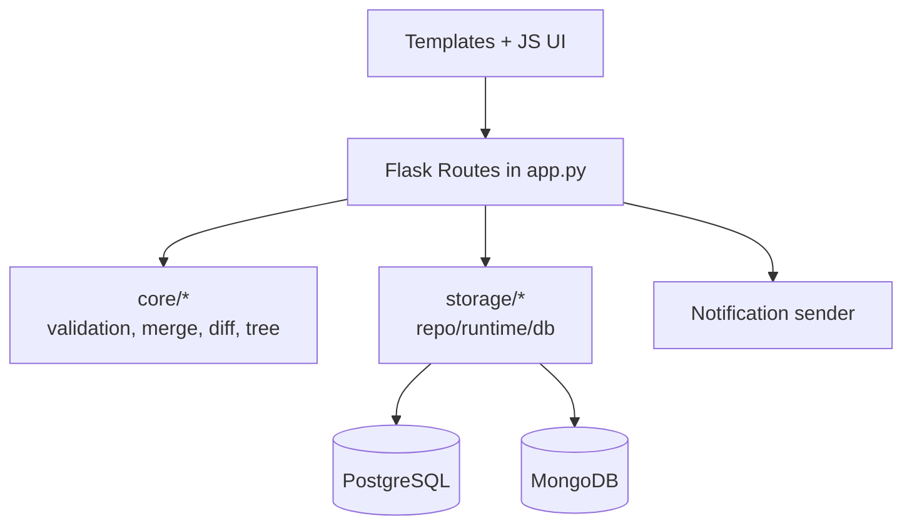

# Data Engineer Matrix (`de_matrix`)

[](https://github.com/SolonnikovDV/de_matrix/actions/workflows/ci.yml)

Веб-приложение для управления матрицей компетенций Data Engineer с процессом согласования изменений, RBAC, обсуждениями CR, уведомлениями и production-ready инфраструктурой на Docker Compose.

---

## Оглавление

- [1. Назначение приложения](#1-назначение-приложения)
- [2. Ключевые функциональности](#2-ключевые-функциональности)
- [3. Архитектура приложения](#3-архитектура-приложения)
- [4. Инфраструктура и компоненты окружения](#4-инфраструктура-и-компоненты-окружения)
- [5. Быстрый старт (администратор)](#5-быстрый-старт-администратор)
- [6. Инструкция для пользователя](#6-инструкция-для-пользователя)
- [7. Инструкция для разработчика](#7-инструкция-для-разработчика)
- [8. Развертывание на голой машине](#8-развертывание-на-голой-машине)
- [9. CI/CD и автодеплой](#9-cicd-и-автодеплой)
- [10. Поддержка и дебаг проблем](#10-поддержка-и-дебаг-проблем)
- [11. API и служебные маршруты](#11-api-и-служебные-маршруты)
- [12. Лицензия](#12-лицензия)

---

## 1. Назначение приложения

`de_matrix` нужен для централизованного управления матрицей компетенций:

- хранение и отображение доменов, навыков, действий и поддействий;
- формализация изменений через Change Requests (CR), ревизии, approval и apply;
- совместная работа через обсуждения, `@mentions` и timeline событий;
- аудит изменений и уведомлений;
- безопасная публикация приложения через HTTPS proxy.

Приложение работает в **DB-first** режиме: основной runtime идет через PostgreSQL + MongoDB.

---

## 2. Ключевые функциональности

### Матрица и визуализация

- страницы матрицы (`/matrix`, `/domain/...`);
- графы (`/graph`, `/domain-graph/...`);
- детали действий/поддействий, level tags, review questions;
- автоскейл дерева и согласованность структуры.

### Импорт/экспорт и merge-режимы

- админ-импорт Excel/JSON/CSV (`/admin/import`) с превью и валидацией;
- **Excel/CSV на `/admin/import`**: два режима:
  - **`increment`** (по умолчанию) — обогащение существующей матрицы: проверка схемы колонок и глубины дерева, слияние по пути Домен → Раздел → Навык;
  - **`replace_all`** — полная замена матрицы (с подтверждением риска);
- первичная загрузка новой матрицы — `replace_all`; догрузка доменов/навыков — `increment`;
- пользовательский конструктор `/constructor` как альтернатива file upload;
- git-style подтверждение из конструктора: `commit title/body`, confirm modal и отправка в CR workflow;
- merge-режимы API (`/api/source/upload*`):
  - `increment` — инкрементальное обогащение при совместимой схеме;
  - `append`
  - `append_to_domain`
  - `append_to_skill`
  - `replace_domain`
  - `replace_skill`
  - `replace_all`
- **табличный контракт `exls_matrix`**: колонки-маркеры (канон для новых файлов):
  - `node_1`, `node_2`, `node_3` — иерархия (Домен → Раздел → Навык);
  - `leaf_1_node_3` … `leaf_5_node_3` — содержимое карточки навыка (вопросы, материалы, задачи, …);
  - `label_1_node_3` … `label_4_node_3` — наклейки навыка (автор, ревьюер, статус, опционально);
  - legacy-заголовки на русском (`Домен`, `Раздел`, …) по-прежнему принимаются при импорте;
- импорт JSON: поддерживаются и единое дерево `nodes`, и legacy-обёртка `domains` (нормализуется в `nodes`);
- загрузка через API (`/api/source/upload*`) принимает `.json`, `.csv`, `.xlsx`, `.xls`;
- JSON-upload поддерживает:
  - unified (`nodes`) и legacy (`domains`) структуру;
  - табличный JSON list-of-records;
  - JSON-книгу формата `{source_file, sheets}` (парсится первый лист);
- для файлового контура `exls_matrix`:
  - `exls_matrix/xlsx_to_json.py`, `exls_matrix/json_to_xlsx.py` — roundtrip JSON workbook ↔ XLSX;
  - `scripts/rename_matrix_markers.py` — переименование русских заголовков в маркеры + генерация XLSX;
- экспорт и шаблон импорта восстанавливают таблицу из БД по `matrix_column_schema` (маркеры как в импортируемом файле);
- дерево в БД хранится реляционно: отдельная таблица на каждый уровень (`matrix_level_registry` + dynamic level tables), свойства навыка — в `skill_payload` JSONB;
- staging batch + diff (`json_patch`, structural diff, upsert-plan).

### Governance и безопасность изменений

- CR workflow: `draft -> submitted -> in_review -> approved/rejected -> applied`;
- обсуждения CR, обязательные треды, блокировка apply при нерешенных критичных вопросах;
- timeline CR;
- RBAC (роли `user` / `admin`);
- сессионная авторизация, смена временного пароля при первом входе.

### Литература

- CRUD литературы;
- загрузка файлов и URL-источников;
- привязка к листам матрицы;
- предпросмотр и открытие внешнего источника.

### Уведомления

- отправка через SMTP (`stdlib`: `smtplib` / TLS — см. `core/smtp_delivery.py`);
- в Compose по умолчанию **Mailpit**: письма не уходят в интернет, их смотрят в веб-UI (порт `DE_MATRIX_MAIL_UI_PORT`, только localhost);
- для внешнего relay: `DE_MATRIX_SMTP_STARTTLS=1` (типично порт **587**) или `DE_MATRIX_SMTP_SSL=1` (порт **465**), плюс `DE_MATRIX_SMTP_USER` / `DE_MATRIX_SMTP_PASSWORD` при необходимости;
- если приложение на хосте, а SMTP в Docker: `DE_MATRIX_SMTP_HOST=127.0.0.1`, `DE_MATRIX_SMTP_PORT` = значение `DE_MATRIX_MAIL_SMTP_PORT` (проброс на Mailpit);
- получатели берутся из поля **email** в профиле пользователя (админы при новом CR, автор при смене статуса, упомянутые в `@mention`);
- журнал отправок `notification_logs` + retry в `/admin/notifications`;
- проверка канала: `docker compose exec -T app python scripts/notification_smoke_check.py` (переменная `DE_MATRIX_NOTIFICATION_TEST_EMAIL`).

### Мониторинг присутствия (admin-only)

- вкладка `/admin/presence` с текущим статусом пользователей (online/away/offline, светофор);
- последнее посещение, длительность активной и последней сессии;
- суммарное время и число сессий за неделю;
- фильтрация по пользователю и статусу + автообновление;
- просмотр истории сессий по пользователю;
- экспорт сводной статистики в CSV.

---

## 3. Архитектура приложения

### 3.1 Контейнерная схема



### 3.2 Поток изменения данных (upload -> approve -> apply)



### 3.3 Логическая схема модулей



---

## 4. Инфраструктура и компоненты окружения

### 4.1 Сервисы Compose и назначение

| Компонент | Где объявлен | Назначение |
|---|---|---|
| `proxy` | `docker-compose.yml` | HTTPS termination, reverse proxy, security headers, rate/conn limits |
| `app` | `docker-compose.yml` | Flask-приложение, API и UI |
| `postgres` | `docker-compose.yml` | Основное хранилище матрицы, approvals, users, notifications |
| `mongo` | `docker-compose.yml` | Хранилище литературы и связанных данных |
| `smtp` (Mailpit) | `docker-compose.yml` | Локальный SMTP + UI для проверки писем |
| `fail2ban` | `docker-compose.prod.yml` | Бан IP по правилам из proxy логов |
| `logrotate` | `docker-compose.prod.yml` | Ротация логов proxy |
| `admin` (Portainer) | `docker-compose.prod.yml` | Локальная админка контейнеров |

### 4.2 Скрипты управления

| Скрипт | Назначение |
|---|---|
| `scripts/start.sh` | **Умный one-click запуск** — самолечение инфры, зависимостей и портов, затем `app.py` |
| `scripts/deploy.sh` | Деплой инфраструктуры (postgres, mongo, smtp) без запуска app |
| `scripts/run_app.sh` | Запуск `python app.py` на хосте (требует готовой инфры) |
| `scripts/deploy_prod.sh` | **Полный деплой** (app + proxy + hardening в Docker) |
| `scripts/up.sh` | Alias на `deploy_prod.sh` (обратная совместимость) |
| `scripts/prod_status.sh` | Статус сервисов и ключевые URL |
| `scripts/prod_down.sh` | Остановка стека |
| `scripts/prod_rebuild.sh` | Переиспользуемый update-сценарий: остановка -> pull/build -> запуск |
| `scripts/prod_cleanup.sh` | Полная очистка `de_matrix` контейнерной группы (контейнеры/сети/тома, опц. образы) |
| `scripts/rename_matrix_markers.py` | Legacy-заголовки exls_matrix → маркеры `node_i`/`leaf`/`label` + генерация XLSX |
| `scripts/smoke_all.sh` | Комплексный smoke/e2e прогон |
| `scripts/db_backup.sh` | Backup PostgreSQL/Mongo |
| `scripts/db_restore.sh` | Restore PostgreSQL/Mongo |

### 4.3 Ключевые переменные окружения

| Переменная | Назначение |
|---|---|
| `DE_MATRIX_SECRET_KEY` | Подпись Flask session |
| `DE_MATRIX_ADMIN_USERNAME` / `DE_MATRIX_ADMIN_PASSWORD` | Bootstrap-admin |
| `DE_MATRIX_AUTH_REQUIRED` | Требовать логин для UI/API |
| `DE_MATRIX_DB_URL` | Подключение PostgreSQL |
| `DE_MATRIX_DB_URL_RUNTIME` | Опциональный runtime override DB URL для `app` контейнера в compose |
| `DE_MATRIX_MONGO_URI` / `DE_MATRIX_MONGO_DB` | Подключение MongoDB |
| `DE_MATRIX_DOMAIN` | Публичный домен (выводится как URL для внешних пользователей) |
| `DE_MATRIX_PROXY_HTTP_PORT` / `DE_MATRIX_PROXY_HTTPS_PORT` | Порты proxy |
| `DE_MATRIX_TLS_MODE` | `selfsigned` / `provided` |
| `DE_MATRIX_NOTIFICATIONS_ENABLED` | Вкл/выкл отправку уведомлений |
| `DE_MATRIX_SMTP_HOST` / `DE_MATRIX_SMTP_PORT` / `DE_MATRIX_SMTP_FROM` | Адрес SMTP, порт, заголовок From |
| `DE_MATRIX_SMTP_STARTTLS` | `1` — STARTTLS после подключения (часто порт 587) |
| `DE_MATRIX_SMTP_SSL` | `1` — implicit TLS, `SMTP_SSL` (часто порт 465); не совмещать с `STARTTLS` |
| `DE_MATRIX_SMTP_USER` / `DE_MATRIX_SMTP_PASSWORD` | Логин SMTP при непустом `USER` |
| `DE_MATRIX_NOTIFICATION_TEST_EMAIL` | Получатель для `scripts/notification_smoke_check.py` |
| `DE_MATRIX_ADMIN_UI_PORT` | Порт Portainer (localhost only) |
| `DE_MATRIX_MAIL_UI_PORT` / `DE_MATRIX_MAIL_SMTP_PORT` | UI/SMTP порты Mailpit на хосте |
| `DE_MATRIX_PROXY_RATE_LIMIT_*`, `DE_MATRIX_PROXY_CONN_LIMIT_PER_IP` | Лимиты proxy |
| `DE_MATRIX_PROXY_IP_WHITELIST`, `DE_MATRIX_PROXY_IP_BLACKLIST` | Списки IP правил |

### 4.4 Структура репозитория (актуальная)

Ниже укороченная структура (сверена с `tig_snapshot_de_matrix.md`):

```text
de_matrix/
├── .github/workflows/
├── config/
├── core/
├── migrations/
├── proxy/
├── scripts/
├── security/
├── static/
├── storage/
├── templates/
├── utils/
├── app.py
├── docker-compose.yml
├── docker-compose.prod.yml
├── Dockerfile
├── requirements.txt
└── README.md
```

---

## 5. Быстрый старт (администратор)

### 5.1 Два режима запуска

| Режим | Команда | URL |
|---|---|---|
| **Разработка (host app)** | `bash scripts/start.sh` | `http://localhost:5001` |
| **Production (all-in-docker)** | `bash scripts/deploy_prod.sh` | `https://localhost` |

**Разработка** — один скрипт делает всё: проверяет Docker, поднимает инфру, чинит порты, обновляет зависимости, запускает app:

```bash
chmod +x ./scripts/*.sh
bash ./scripts/start.sh
```

> `start.sh` — самодостаточный: при первом запуске копирует `.env.example` → `.env`, создаёт `.venv`, устанавливает зависимости. При повторных — умный `no-op` для всего, что уже готово.

**Production / полный стек** — app + proxy + hardening в контейнерах:

```bash
bash ./scripts/deploy_prod.sh
# alias: bash ./scripts/up.sh
```

Пересборка production-стека:

```bash
bash ./scripts/prod_rebuild.sh
```

Пересборка только инфраструктуры для host-режима:

```bash
bash ./scripts/prod_rebuild.sh --host-dev
bash ./scripts/start.sh
```

### 5.2 Первый запуск (кратко)

```bash
chmod +x ./scripts/*.sh
bash ./scripts/start.sh   # всё остальное — автоматически
```

Проверка:

```bash
bash ./scripts/prod_status.sh
```

### 5.3 Вход в приложение

- локально: `https://localhost` (или порт из `.env`);
- вход по `DE_MATRIX_ADMIN_USERNAME` / `DE_MATRIX_ADMIN_PASSWORD`;
- при первом входе смените пароль на `/account/password`.

### 5.4 Админ-разделы

- пользователи: `/admin/users`
- SQL console: `/admin/sql-console`
- tree editor: `/admin/tree-editor`
- журнал уведомлений: `/admin/notifications`
- CR review: `/changes`

---

## 6. Инструкция для пользователя

1. Откройте URL приложения, который выдал администратор (обычно `https://<domain>`).
2. Войдите под своим логином/паролем.
3. Рабочие разделы:
   - просмотр матрицы и графов;
   - просмотр деталей action/subaction;
   - импорт данных (создает CR для согласования);
   - литература и привязка к листам.
4. Следите за статусом своих CR на `/changes`.
5. Если админ запросил доработки в discussion (`needs_author_response`), обновите CR и отправьте повторно.

---

## 7. Инструкция для разработчика

### 7.1 Подготовка локальной среды

`start.sh` создаёт `.venv` и устанавливает зависимости автоматически.  
Для ручной настройки:

```bash
python3 -m venv .venv
source .venv/bin/activate
pip install -r requirements.txt
```

### 7.2 Подъем окружения

Host app (рекомендуется для разработки):

```bash
bash ./scripts/start.sh   # one-click: инфра + порты + deps + app
```

Только инфраструктура (без запуска app):

```bash
bash ./scripts/deploy.sh
```

Full docker stack:

```bash
bash ./scripts/deploy_prod.sh
```

### 7.3 Базовые проверки

```bash
docker compose exec -T app python scripts/db_init.py
docker compose exec -T app python scripts/db_smoke_check.py
docker compose exec -T app python scripts/autoscale_regression_check.py
docker compose exec -T app python scripts/e2e_merge_modes_check.py
```

### 7.4 Полный регрессионный прогон

```bash
bash ./scripts/smoke_all.sh --rollback
```

### 7.5 Где смотреть код

- backend/API: `app.py`
- доменная логика: `core/` (в т.ч. `core/smtp_delivery.py` для почты)
- persistence/repositories: `storage/`
- шаблоны UI: `templates/`
- инфраструктура: `docker-compose*.yml`, `proxy/`, `scripts/`
- сервисные миграционные утилиты: `scripts/migrate_file_to_db.py`, `scripts/merge_to_unified_source.py`, `scripts/turn_to_base_config.py`

---

## 8. Развертывание на голой машине

### 8.1 Предпосылки

- Linux host (рекомендуется для полного fail2ban поведения);
- Docker Engine + Docker Compose plugin;
- открытые внешние порты для proxy (`80/443` или ваши кастомные);
- DNS/A-record на сервер (для production-домена).

### 8.2 Шаги

1. Скопируйте проект на сервер.
2. Настройте `.env`:
   - `DE_MATRIX_DOMAIN=<your-domain>`
   - production-секреты (`DE_MATRIX_SECRET_KEY`, admin password, SMTP и т.д.).
3. Для production TLS:
   - `DE_MATRIX_DEPLOY_TARGET=production`
   - `DE_MATRIX_TLS_MODE=provided`
   - положите:
     - `proxy/certs/provided/fullchain.pem`
     - `proxy/certs/provided/privkey.pem`
4. Поднимите стек:

```bash
bash ./scripts/up.sh
```

Для обновления уже раскатанного окружения используйте переиспользуемый сценарий:

```bash
bash ./scripts/prod_rebuild.sh
```

Полная очистка контейнерной группы `de_matrix` (деструктивно):

```bash
bash ./scripts/prod_cleanup.sh --yes
```

5. Проверьте:
   - `bash ./scripts/prod_status.sh`
   - `https://<your-domain>/proxy-health`
   - вход в `https://<your-domain>`.

### 8.3 Доступ к Portainer только через SSH tunnel

```bash
ssh -L 19000:127.0.0.1:19000 <user>@<host>
```

Затем открыть локально: `http://127.0.0.1:19000`.

---

## 9. CI/CD и автодеплой

### 9.1 Что проверяет CI

CI workflow: `.github/workflows/ci.yml`

На каждый `push` и `pull_request` выполняются:
- статические проверки Python (`py_compile` ключевых модулей и скриптов);
- валидация `docker-compose.yml` и `docker-compose.prod.yml`;
- проверка обязательных сервисов в compose-конфигурации;
- интеграционный smoke/e2e прогон (`scripts/smoke_all.sh`).

### 9.2 Как работает CD

CD workflow: `.github/workflows/deploy-prod.yml`

Автодеплой выполняется:
- после успешного завершения `de_matrix CI` для `push` в `main`;
- после успешного `de_matrix Release Gate`;
- вручную через `workflow_dispatch`.

CD разворачивает **один и тот же ref на все целевые хосты**, где расположен клон репозитория.

### 9.3 Конфигурация хостов для автодеплоя

Рекомендуемый способ: секрет `PROD_DEPLOY_TARGETS_JSON` (JSON-массив целей).

Пример:

```json
[
  {"host":"10.0.1.10","user":"deploy","port":"22","app_dir":"/opt/de_matrix"},
  {"host":"10.0.1.11","user":"deploy","port":"22","app_dir":"/opt/de_matrix"}
]
```

Обязательные поля на цель:
- `host`
- `user`
- `app_dir`

Опционально:
- `port` (по умолчанию `22`).

Обязательный общий секрет для всех целей:
- `PROD_SSH_PRIVATE_KEY` (закрытый SSH-ключ деплой-пользователя).

Требования к целевому хосту (для `app_dir`):
- в `app_dir` уже существует клон репозитория `de_matrix` с доступным `origin`;
- у deploy-пользователя есть права на `git fetch/checkout`, запуск Docker Compose и выполнение `scripts/*.sh`;
- на хосте установлены Docker Engine + Compose plugin.

### 9.4 Обратная совместимость (single-host)

Если `PROD_DEPLOY_TARGETS_JSON` не задан, используется legacy-набор секретов:
- `PROD_SSH_HOST`
- `PROD_SSH_USER`
- `PROD_APP_DIR`
- `PROD_SSH_PORT` (опционально)
- `PROD_SSH_PRIVATE_KEY` (обязательно)

### 9.5 Rollback для всех хостов

Workflow `.github/workflows/deploy-rollback.yml` использует тот же список целей и выполняет rollback на каждом хосте.

### 9.6 Локальный запуск и связь с CD

Текущая реализация поддерживает запуск на локальной машине:
- локально: `bash ./scripts/up.sh`
- production/CD: через GitHub Actions и SSH-доступ к целевым хостам

Автодеплой не мешает локальной разработке: локальный контур работает независимо от GitHub Actions.

---

## 10. Поддержка и дебаг проблем

### 10.1 Быстрая диагностика

```bash
bash ./scripts/prod_status.sh
docker compose -f docker-compose.yml -f docker-compose.prod.yml logs --tail=200 app
docker compose -f docker-compose.yml -f docker-compose.prod.yml logs --tail=200 proxy
```

### 10.2 Частые проблемы

| Симптом | Причина | Решение |
|---|---|---|
| `permission denied: ./scripts/up.sh` | Нет execute-bit | `chmod +x ./scripts/*.sh` или запуск `bash ./scripts/up.sh` |
| `401 Authentication required` в API | Нет валидной сессии | Выполнить login, проверить cookie и `DE_MATRIX_AUTH_REQUIRED` |
| `Password change required` | Временный пароль | Завершить смену пароля на `/account/password` |
| `app restarting` | рассинхрон схемы БД/моделей | применить миграции и перезапустить app |
| e2e/smoke fail после rollback | Изменилось состояние БД | повторить `db_init`, проверить пользователей и CR |
| Инкремент: «глубина дерева не совпадает» | Устаревший `ui_config` в БД после Apply | обновить app, при необходимости повторный Apply CR с актуальным `ui_config` |
| Нет писем на реальную почту | Mailpit только перехватывает SMTP | открыть UI Mailpit по `DE_MATRIX_MAIL_UI_PORT` или настроить внешний SMTP + TLS/логин |
| Уведомления `skipped` / пустые получатели | В профиле нет email | заполнить email у админов/авторов; смотреть `/admin/notifications` |
| `Connection refused` к SMTP | Неверный host/port для среды | в контейнере app — `smtp:1025`; с хоста — `127.0.0.1` и порт проброса Mailpit |

### 10.3 Backup/restore и восстановление

```bash
bash ./scripts/db_backup.sh
bash ./scripts/db_restore.sh <backup_dir>
```

После восстановления:

```bash
docker compose restart app
bash ./scripts/prod_status.sh
```

---

## 11. API и служебные маршруты

### Core API

- `GET /api/matrix`, `GET /api/tree`, `GET /api/meta`
- `POST /api/source/upload/preview`, `POST /api/source/upload`
- `GET /api/changes`, `GET /api/changes/<id>`, status/apply/discussion/timeline endpoints
- `GET /api/literature`, CRUD/link/upload/download
- `GET /api/admin/notifications`, `POST /api/admin/notifications/<id>/retry`

### Служебные

- `GET /api/schema` — схема и версия
- `GET /proxy-health` — health proxy
- `GET /debug` — отладочная информация

---

## 12. Лицензия

MIT, см. `LICENSE`.
